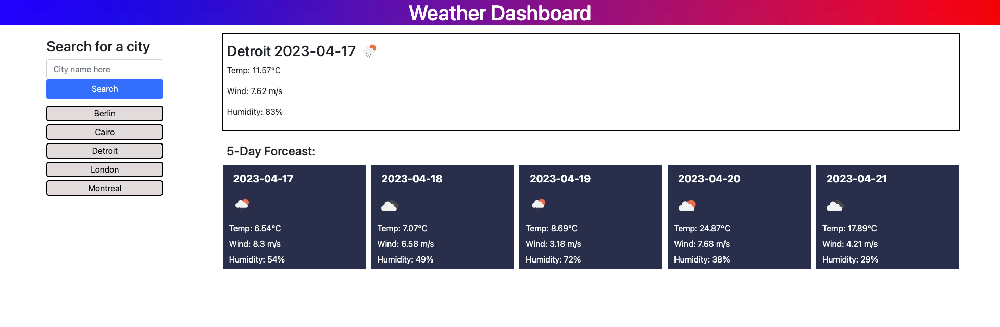

# Weather-Dashboard

A weather dashboard that returns the current weather report and the forecast for the next 5 days!

## Description

This web app acts as a weather dashboard that provides weather reporting for the next 5 days. The user is to enter a city in the search bar and click the blue search button. A report will then appear indicating the city name, current date, temperature, wind, & humidity. There will also be an icon that shows the current weather conditions.

Below this section, the user can find the same information for the next 5 days but shown on a more compact card section.

The user search is also saved and displayed on the left side of their screen. The user can click any of these saved cities to re-display current weather conditions.

## Installation

Load index.html file to access weather report.
This web app uses jQuery & CSS Bootstrap, which are both called in the index.html file.

## Usage

Page can alternatively be accessed [here](https://nadeemtalaat.github.io/Weather-Dashboard/).

## Credits

- Nadeem Talaat

## License

[MIT](https://choosealicense.com/licenses/mit/)
